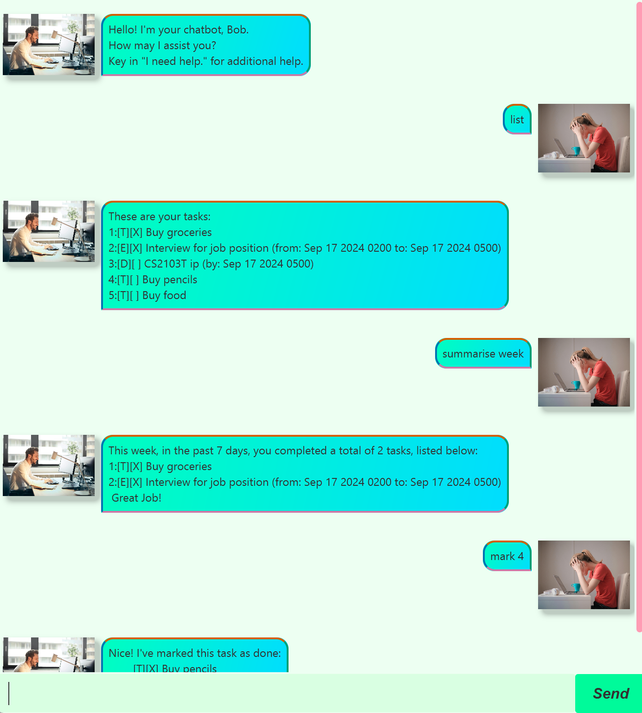

# Bob

**Bob** is a simple chatbot application written in Java and developed for NUS' CS2103T Software Engineering Course.

Bob manages your todos, events and deadlines,
allowing you to mark, unmark, add, delete and list these tasks. 
In addition, he can help to summarise the tasks you have completed in the
past week, or any range you specify.

For additional information on Bob and his functionalities, click [here](https://colinac.github.io/ip/) for the user guide.

